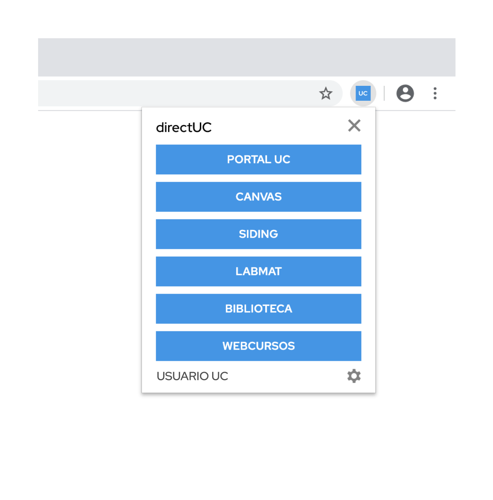

<h1 align="center">
  
</h1>

  
  
  
  
   
  
  
  

  Extensión Web que permite a alumnos y funcionarios de la Pontificia Universidad Católica de Chile el ingreso directo a diferentes servicios ofrecidos por esta.

---

- [Instalar](#install)
- [Características](#caracteristicas)
- [Development](#development)

---

## Instalar

Disponible también en las tiendas de [Edge](https://bit.ly/directUCedge) y [Opera](https://bit.ly/directUCopera).

## Características

Guarda tu usuario y contraseña una sola vez y accede a través de una
ventana emergente a diferentes servicios con solo presionar un
botón de la lista.

### Modo Directo

Ingresa directamente a un servicio seleccionado.

### Omnibox

Escribe <kbd>uc</kbd> + <kbd>espacio</kbd> + <kbd>\<nombre de servicio\></nombre></kbd>
para ingresar directamente desde la barra de direcciones.

### Servicios disponibles

- Canvas
- Correo UC
- Portal UC
- Google Drive UC
- Webcursos
- Biblioteca
- SIDING
- LABMAT

## Development

See [DEVELOPMENT.md](DEVELOPMENT.md)

---

Terms & Conditions / Privacy Policy: See [POLICIES.md](POLICIES.md)

> Esta es una extensión no oficial y no guarda relación alguna con la Pontificia Universidad Católica de Chile.
